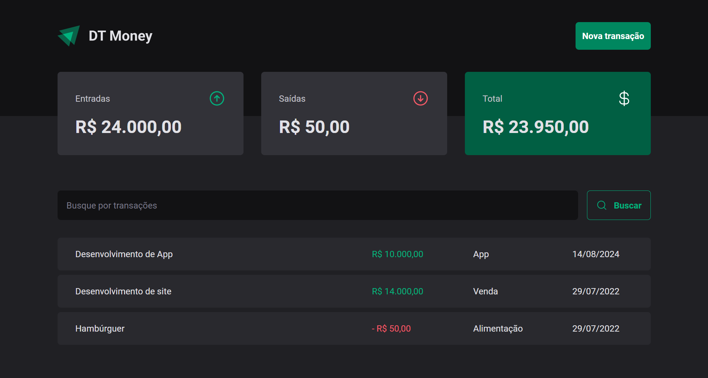

# DT-Money-Ignite



## Technologies

- `React.js`
- `TypeScript`
- `Styled-Components`
- `React-Router-Dom`
- `React-Hook-Form`
- `Zod`
- `Context API`
- `Memo`
- `useMemo`
- `useCallback`

## Installation

```bash
# Clone repository
$ git clone https://github.com/EmanuelQuintino/DT-Money-Ignite.git

# Install dependencies
$ npm install

# Run project
$ npm run dev
```

## Links

- [Deploy](https://dt-money-ignite-zeta.vercel.app/)
